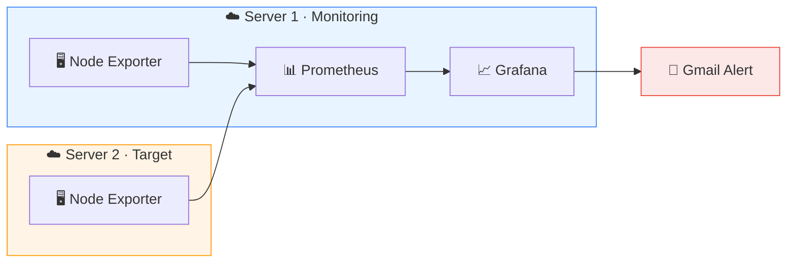

<div align="center">

# 📡 Server Monitoring & Alerting

**Prometheus • Node Exporter • Grafana on AWS EC2**

</div>

---

## 📌 Overview

A hands-on DevOps project that monitors **two Linux servers on AWS EC2** and sends an **email alert** when CPU usage crosses a threshold.

I built it to understand how monitoring works **end to end**, instead of learning each tool separately.

> [!TIP]
> Alert flow: **CPU spike → Node Exporter → Prometheus → Grafana → Email Alert**

---

## 🧰 Tech Stack

| 🔧 Tool | 🎯 Purpose |
|:--|:--|
| ☁️ **AWS EC2** | Two Linux servers |
| 🖥️ **Node Exporter** | Exposes CPU, memory, disk, and network metrics |
| 📊 **Prometheus** | Collects and stores metrics |
| 📈 **Grafana** | Dashboards and alerting |
| 📧 **Gmail SMTP** | Delivers alert emails |

---

## 🏗️ Architecture



| Server | Role | Runs |
|:--|:--|:--|
| 🟦 **Server 1** | Monitoring | Node Exporter, Prometheus, Grafana |
| 🟧 **Server 2** | Target | Node Exporter |

---

## ⚙️ How It Works

1. 🖥️ **Node Exporter** exposes system metrics on port `9100` of both servers.
2. 📊 **Prometheus** scrapes both targets at a fixed interval.
3. 📈 **Grafana** reads from Prometheus and shows live dashboards.
4. 🔔 A **Grafana alert rule** watches CPU usage.
5. 📧 When CPU stays above the threshold, an **email** is sent through Gmail.

---

## 🔔 Alerting

```promql
100 - (avg by (instance) (rate(node_cpu_seconds_total{mode="idle"}[5m])) * 100)
```

> [!NOTE]
> The alert fires only when high CPU **persists** for the configured period, which avoids false alarms from short spikes.

---

## 🧪 Testing

I simulated real load on the monitored server and verified the whole pipeline.

```bash
stress-ng --cpu 0 --timeout 300s
```

| Step | Result |
|:--|:--:|
| CPU spike visible in Grafana | ✅ |
| Alert moved to *Firing* | ✅ |
| Email notification received | ✅ |

---

## 💡 What I Learned

- 🔹 How Prometheus **pulls** metrics from exporters
- 🔹 Writing basic **PromQL** queries
- 🔹 Turning a dashboard panel into an **alert rule**
- 🔹 Configuring **SMTP** contact points in Grafana
- 🔹 Locking down ports with **EC2 security groups**

---

<div align="center">

*Still learning, still building.* 🚀

</div>
